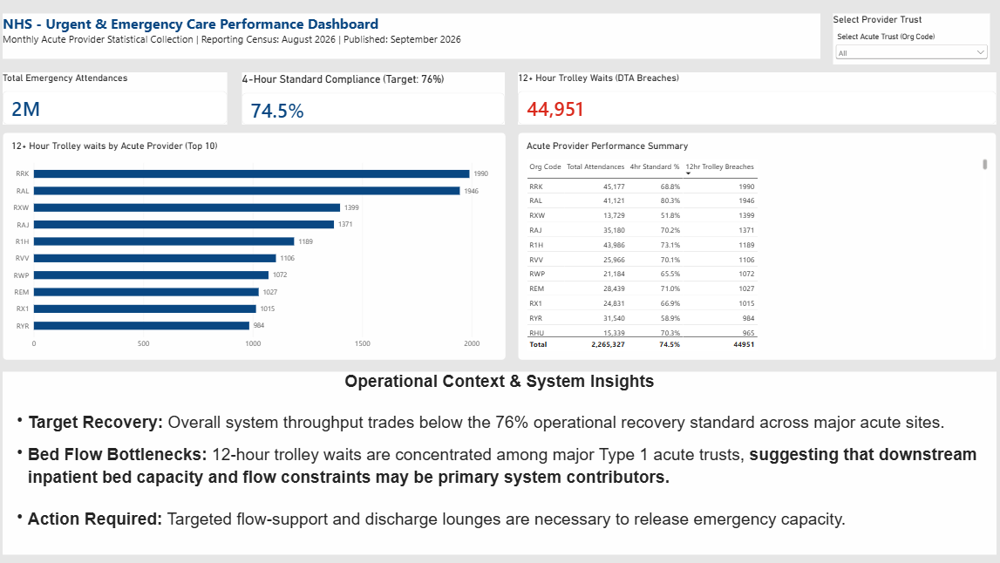

# NHS England - Urgent & Emergency Care Operational Performance Analytics

[](https://powerbi.microsoft.com/)
[](https://docs.microsoft.com/en-us/dax/)
[](https://www.england.nhs.uk/statistics/statistical-work-areas/ae-waiting-times-and-activity/)

An executive business intelligence dashboard and dimensional model analyzing operational throughput, recovery target variance, and downstream-bed-capacity bottlenecks across NHS acute providers for the August 2026 reporting census.

---

## Executive Dashboard 



---

## Operational Objectives & Context 
* **Throughput & Capacity Oversight:** Aggregate and monitor operational volume across major acute trusts (covering 2.2M+ total emergency attendances in the August 2026 census).
* **Target Recovery Benchmarking:** Track acute provider compliance against the NHS operational recovery standard of **76%** for four-hour emergency throughput.
* **Flow Bottleneck Identification:** Isolate extreme patient delays (12+ hour Decision-to-Admission breaches) to highlight secondary-care capacity constraints impacting front-door emergency flow.

---

## Data Architecture & Data Modeling 

Raw statistical releases from NHS England were transformed and structured into an analytical Star Schema to optimize DAX query performance:

* **'Fact_AE_Activity':** Records monthly operational activity across acute trusts, including Type 1 attendances, four-hour standard breaches, and 12+ hour Decision-to-Admission (DTA) trolley delays.
* **'Dim_Trust':** Dimension table capturing unique acute provider identifiers ('Org Code') and organizational metadata.
* **'Dim_Calendar':** Temporal dimension establishing standard reporting intervals.
* **'_Measures':** Isolated analytical measures table containing explicit DAX calculations.

---
## Key DAX Measures 
### 1. 4-Hour Standard Compliance %
Tracks system-wide througput against the national operation target:
```dax
4hr Standard % = 
DIVIDE(
    [Total Attendances] - SUM(Fact_AE_Activity[Total Over 4 Hours]),
    [Total Attendances],
    0
)
```

### 2. Total Attendances
Aggregates total emergency department attendances across all reporting acute trusts:
```dax
Total Attendances = 
SUM(Fact_AE_Activity[Total Attendances])
```

### 3. 12+ Hour Decision-to-Admission (DTA) Trolley Breaches
Isolates severe boarding events across acute providers for mathematical aggregation and horizontal bar chart ranking: 
```dax
12hr Trolley Breaches = 
SUM(Fact_AE_Activity[Patients who have waited 12+ hrs from DTA to admission])
```

### 4. Formatted Display Measure for Executive KPI Card
Converts numeric breaches to formatted text to preserve exact comma separators and prevent visual auto-scaling: 
```dax
12hr Trolley Breaches Card = 
FORMAT(
    [12hr Trolley Breaches], 
    "#,##0"
)
```

--- 

## Key Operational Insights
* **Target Recovery:** Overall system throughputs trades at **74.5%**, remaining below the 76% operational recovery standard across major acute sites.
* **Bed Flow Bottlenecks:** 12-hour trolley waits (**44,951 total breaches**) are concentrated among major Type 1 acute trusts, suggesting that downstream inpatient bed capacity and flow constraints may be primary system contributors.
* **Action Required:** Targeted flow-support and discharge lounges are necessary to release emergency capacity.

--- 

## How to Explore This Project 

1. Clone the repository:
   ```bash
   git clone [https://github.com/kuziDanga15/nhs-uec-operational-performance-analytics.git](https://github.com/kuziDanga15/nhs-uec-operational-performance-analytics.git)
   ```
2. open '/docs' to inspect full-restoration dashboard visual assets and layout captures.
3. Review '/src/measures/' for explicit DAX expressions, data transformations, and star schema dimensional mapping.
   
   


